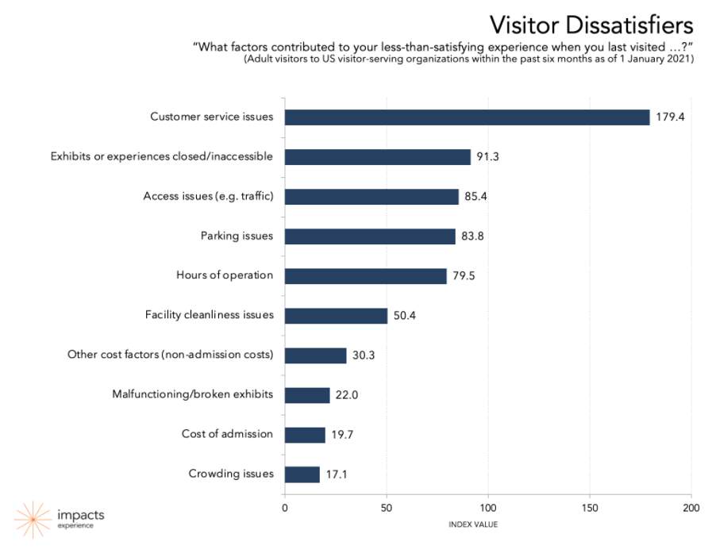
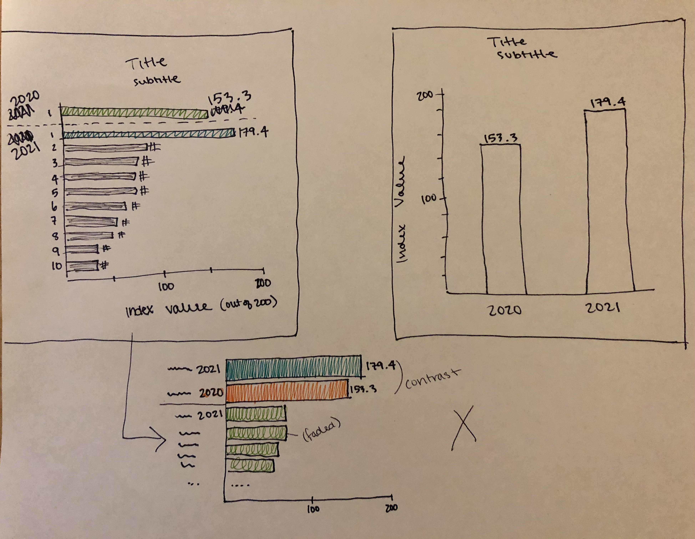

# Assignment 3 & 4: Critique by Design

<h3>Original Visualization and Critique:</h3>

 
Source: https://www.colleendilen.com/2021/02/03/safety-first-museum-visitors-expect-better-mask-enforcement-data/

I chose this visualization because I felt it didn't reflect the story that was being told in the text that accompanied it. The original chart simply visualizes the data collected for a survey question in the current year; however, the text beneath it explains that one of the measures ("Customer service issues") has greatly increased since this time last year. I thought that the chart would be more useful to the reader (primarily arts/culture professionals who will use this information to make decisions in running their own organizations) if it highlighted this change. Completing the Data Visualization Effectiveness Profile helped me realize that I liked the use of a bar chart for this data - this didn't need to change, especially since the audience is not looking to interact with this chart or needs to be attracted to it in the first place, but, rather, gain useful information from it quickly - but it also helped me identify a few things I could change to better tell the story: by using color to compare the the "Customer service issues" measure in 2021 vs. 2020 and writing a more impactful title and subtitle for the visualization.

<h3>Wireframing on Paper and Infogram:</h3>

First, I sketched a couple designs on paper. I couldn't decide if I wanted to include all the dissatisfaction measures or just the "Customer service issues" measure and compare 2020 vs. 2021 (Note: if I had the data for all measures from 2020, I would have considered including the rest from 2020, as well.) I decided to include all measures from 2021 to give the audience an idea of what other measures existed and how much lower their index values were than "Customer service issues" in 2021. I also had to decide how to group the measures on the y-axis in terms of both order and value: did I want to distinguish the measures by year, measure, or both? I completed the final wireframe using Infogram (see second image below), ordering the y-axis measures by year, then value. I grouped the "Customer service issues" measures by using different hues of red, contrasting the rest of the measures in grey.

<a href="https://infogram.com/2e87c1bf-732d-4b1e-b044-66e827f5c87d" style="color:#989898!important;text-decoration:none!important;" target="_blank">TSWD Assignment 4</a> <a href="https://infogram.com" style="color:#989898!important;text-decoration:none!important;" target="_blank" rel="nofollow">Infogram</a>

<h3>User Feedback:</h3>

The feedback from both people who looked at my Infogram wireframe confirmed that they were able to describe what the visualization was telling them and who the audience is: that it shows the increase of reported dissatisfactory customer service interactions, comparing January 2020 to January 2021, and the audience is probably arts facilities administrators and management. One person's feedback pointed out one major issue with my version, though: they commented that "the main complaint is that exhibits are closed" - which isn't actually true. The way I colored the other measures in grey conveyed to this person that the grey measures were a subgroup of measures within "Customer service issues" rather than part of the same group of data. One person also pointed out that they were confused by the grey bars' values; since I didn't want to change the units from the original version and data, I just clarified that the index values were out of 200 in the final version (see below). 

<h3>Final Visualization</h3>

In the final version of the redesign, I resolved the issue brought up in the wireframe feedback I received by making all 2021 measures' bars the same color. By grouping the "Customer service issues" measures from 2021 and 2020 together, this still gives the audience the ability to compare those values quickly. I did not change that many elements of the chart from the original version, to the wireframe, to the final redesign because the horizontal bar chart is quick and easy to understand, and it was properly ordered in the original version. The changes I made were to integrate the written story in the text with the original chart's data to increase impact on the audience.

[Back to Portfolio](/portfolio)
